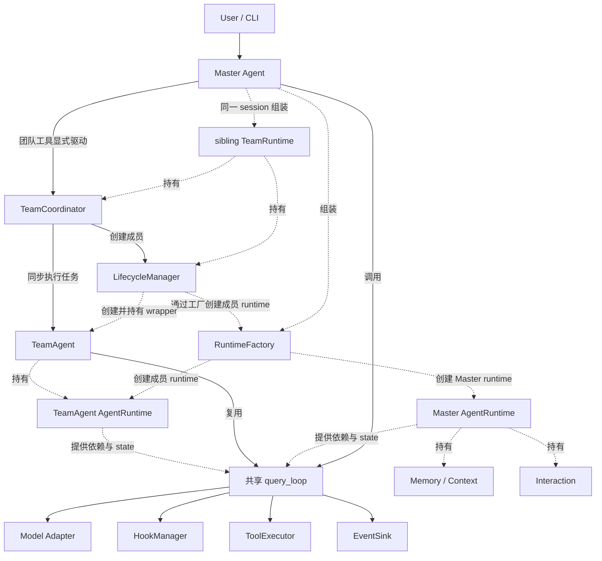

# lite_harness

A small, structured agent harness for studying and validating tool-using LLM agent architectures.

一个用于学习、实现和验证 Agent 核心架构的轻量项目。在保持代码规模可理解的前提下，将模型调用、工具执行、记忆管理、Hook、事件、交互和 Agent Team 等机制组织成结构清晰、可观察、可测试的 Harness，定位为学习与架构参考。

## Why this project?

项目从学习和复现 [learn-claude-code](https://github.com/shareAI-lab/learn-claude-code) 开始。它通过逐课引入机制，帮助理解工具调用型 Agent 的组成，是本项目的重要学习来源。

在 `learn_harness` 的复现实践中，逐渐形成了对运行时所有权、执行循环复用和组件契约的进一步需求。随后创建 `lite_harness`，围绕 Runtime、query loop、model contract、Tool、Hook、Event、Interaction、Memory 和 Agent Team 重新设计职责边界，用较小的实现研究这些机制如何协作。

## Project evolution

```text
learn-claude-code
    ↓ 学习与复现（study / reproduce）
learn_harness
    ↓ 架构重新设计（architectural redesign）
lite_harness
```

前一阶段重在理解和复现教学实现，后一阶段重在独立探索组件边界与可测试的运行结构。

## Design goals

- **规模精简、结构完整**：保留模型、工具、记忆、Hook、事件和交互的明确职责，让核心流程容易理解。
- **共享执行循环**：Master、Subagent 和 TeamAgent 复用 `query_loop()`，通过 `RunPolicy` 与独立 state 配置运行差异。
- **显式运行时所有权**：`RuntimeFactory` 组装 `AgentRuntime` 的依赖；团队共享服务由同会话的 sibling `TeamRuntime` 持有。
- **显式内部契约**：模型适配器使用统一的请求与响应类型，事件输出和用户交互分别通过 EventSink 与 Interaction 契约处理。
- **可观察、可测试的状态转换**：用 Hook、运行事件和团队成员状态记录执行边界，默认测试可在不访问模型的情况下验证流程。
- **明确上下文成本与权限边界**：集中执行工具，保留工具审批、记忆策略及上下文预算与压缩机制。

独立的 agent state 表示消息历史与运行状态分开管理；团队成员仍共享 workspace，任务由 Master 显式驱动，当前没有文件系统隔离或并行团队调度。

## Architecture



实线表示输入、调用或任务执行路径，虚线表示组装、持有或依赖供给。Master 调用 `query_loop(runtime)`；`AgentRuntime` 持有运行依赖与状态，循环使用这些组件完成模型调用、Hook 检查、工具执行和事件发布。成员 runtime 同样包含记忆、上下文和交互组件，图中仅展开 Master 的这部分依赖。

Master 为同一会话组装 `AgentRuntime` 与 sibling `TeamRuntime`。成员由 `LifecycleManager` 通过 `RuntimeFactory` 创建，再由 TeamAgent wrapper 复用同一执行循环；创建成员本身不会启动模型。详细职责与执行边界见 [Runtime](doc/architecture/runtime.md)、[Agent Loop](doc/architecture/agent_loop.md) 和 [Agent Team](doc/architecture/agent_team.md)。

## Feature Status

| Capability | Status | Notes |
| --- | --- | --- |
| Unified model contract | Implemented | Anthropic / OpenAI / Gemini / LangChain 适配器使用统一请求与响应类型。 |
| Shared `query_loop()` | Implemented | Master / Subagent / TeamAgent 共用执行循环。 |
| Runtime abstraction | Implemented | RuntimeFactory / AgentRuntime / RunPolicy 与独立 state。 |
| Tool execution | Implemented | ToolExecutor 集中执行工具。 |
| Hook / permission flow | Implemented | PreToolUse 等生命周期 Hook 与交互式审批。 |
| Event / Interaction | Implemented | 运行事件输出与用户输入、审批交互分离。 |
| Memory / context handling | Implemented | 显式记忆策略、上下文预算与压缩机制。 |
| Agent Team | Experimental | Master-driven orchestration：Master 显式创建成员、分配任务、续跑与收尾。 |
| Autonomous team scheduling | Not implemented | 没有 idle task scan 或 autonomous task claiming。 |
| Worktree isolation | Not implemented | 成员共享 workspace，没有任务绑定的独立 worktree。 |
| Production deployment | Out of scope | 定位为学习与架构参考 Harness。 |

## Quick Start

项目使用 [uv](https://docs.astral.sh/uv/getting-started/) 管理依赖。

在 PowerShell 中安装依赖并运行：

```powershell
uv sync
.venv\Scripts\Activate.ps1
uv run main.py
```

当前默认模型配置为：

```text
api:       anthropic
model_url: http://localhost:8000
api_key:   no-key
model_name: claude-fable-5
```

默认地址是项目的本地模型服务配置，不代表项目自带模型服务。也可以通过命令行参数覆盖配置：

```powershell
uv run main.py `
  --api anthropic `
  --model_url http://localhost:8000 `
  --api_key no-key `
  --model_name claude-fable-5
```

支持的 API 类型包括：`anthropic`、`openai`、`gemini` 和 `langchain`。

## Agent Team

Agent Team 沿用主程序的模型配置，可连接受支持的模型提供方 API，也可连接符合相应协议的本地模型服务。运行前根据所用服务设置 `--api`、`--model_url`、`--model_name` 和鉴权参数 `--api_key`；参数用法见 [Quick Start](#quick-start)。模型地址、名称和鉴权要求以所用服务为准。

Master 可在同一会话创建 TeamAgent、分配团队任务、查询状态，并在安全收尾后退出。TeamAgent 复用现有 query loop；团队成员、消息和任务状态由独立的 TeamRuntime 管理。架构见 [Agent Team](doc/architecture/agent_team.md)。

默认 pytest 不访问模型。单成员 smoke 和双成员/恢复场景须手动运行；服务检查、完整命令、JSON 通过标准以及交互式 Master 操作见 [Agent Team 运行测试笔记](doc/note/s13_agent_team_testing_note.md)。笔记中的模型和本地服务仅是一次验收所用的示例，换用其他模型或提供方 API 时需调整连接与鉴权参数；真实令牌不要写入文档或提交到仓库。

## 运行主线

CLI 负责接收用户输入和显示输出，Runtime 负责组装运行时依赖，query loop 负责模型调用和工具编排：

```text
CLI → RuntimeFactory → query_loop → Model / Hook / Tool → EventSink
```

一次典型运行包含以下步骤：

1. 创建 `AgentRuntime`，注入模型、工具、记忆、Hook、事件和交互组件。
2. 获取用户输入并运行 `UserPromptSubmit` Hook。
3. `query_loop()` 调用模型，处理模型消息和工具调用。
4. `PreToolUse` Hook 检查工具权限，必要时通过 Interaction 请求审批。
5. `ToolExecutor` 执行工具，EventSink 发布运行事件。
6. 没有新的工具调用时运行 `Stop` Hook，并返回本轮状态。

## 项目结构

```text
lite_harness/
├── api/                         # 模型请求、响应和厂商适配器
│   ├── contract.py              # ModelRequest、ModelResponse 等统一类型
│   ├── *_adapter.py             # Anthropic、OpenAI、Gemini 等适配器
│   └── old_api/                 # 旧版模型 API，保留用于兼容
├── core/                        # Agent 核心流程
│   ├── runtime.py               # AgentRuntime、RunPolicy、state
│   ├── loop.py                  # query_loop 工作循环
│   └── agent.py                 # CLI Agent 顶层入口
├── builtin/                     # 内置记忆、提示词、产物和恢复逻辑
├── cli/                         # CLI 交互和事件渲染
├── event/                       # Event、EventSink 和 Interaction Protocol
├── hook/                        # HookManager 和默认 Hook
├── tools/                       # 工具注册、执行和上下文压缩
├── team/                        # TeamRuntime、成员生命周期、通信和任务编排
├── scripts/                     # 显式运行的本地模型验收入口
├── config/                      # 启动参数和运行配置
├── doc/architecture/            # 架构说明文档
├── doc/note/                    # 操作与学习笔记
├── tests/                       # 单元测试和流程测试
├── main.py                      # 程序启动入口
├── pyproject.toml               # 项目和依赖配置
└── uv.lock                      # 依赖锁定文件
```

## 架构文档

- [Architecture Principles](doc/architecture/principles.md)：项目架构原则。
- [Agent](doc/architecture/agent.md)：Agent 顶层入口、输入循环和输出处理。
- [Agent Loop](doc/architecture/agent_loop.md)：query loop、工具调用和压缩生命周期。
- [Runtime](doc/architecture/runtime.md)：Runtime、RunPolicy、state 和组件组装。
- [Event](doc/architecture/event.md)：事件类型、EventSink 和事件顺序。
- [Hook](doc/architecture/hook.md)：HookManager、权限检查和 Hook 生命周期。
- [Interaction](doc/architecture/interaction.md)：用户输入、审批请求和交互实现。
- [Model API Contract](doc/architecture/model_api_contract.md)：统一模型请求、响应和适配器协议。
- [Agent Team](doc/architecture/agent_team.md)：团队组装、消息、任务与生命周期。
- [Testing](doc/architecture/testing.md)：离线与显式真实模型测试的边界。

## 已知问题

1. 用户拒绝执行指令后，Agent 仍可能多次尝试执行相同或相似的命令，然后再次询问用户。
2. 记忆加载不需要内容或加载失败时，当前流程仍可能等待较长时间。

## 项目参考

- [learn-claude-code](https://github.com/shareAI-lab/learn-claude-code)
- [Claw Code](https://github.com/ultraworkers/claw-code)
- [-awesome-cc-harness](https://github.com/WanLanglin/-awesome-cc-harness)

## Attribution

`lite_harness` 起源于对 [learn-claude-code](https://github.com/shareAI-lab/learn-claude-code) 的学习和复现，并经由 `learn_harness` 演化而来。后续围绕运行时、执行循环、模型契约、事件 / Hook / 交互以及多 Agent 架构进行了独立的边界重新设计。

本项目与上游项目或其维护者没有官方隶属关系。上游归属与许可证声明见 [THIRD_PARTY_NOTICES.md](THIRD_PARTY_NOTICES.md)。
