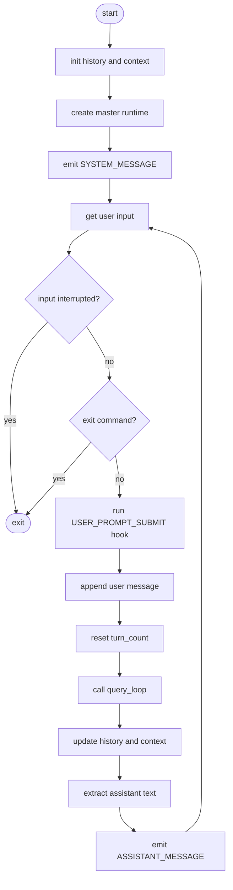

# Agent 顶层入口

`core/agent.py` 是 CLI Agent 的顶层编排入口。它负责创建主 Agent Runtime、接收用户输入、调用 query loop 和输出 Assistant 文本，不实现模型调用、工具执行或压缩策略。

## 1. Agent 层的职责

```text
用户输入 → Agent 顶层入口 → AgentRuntime → query_loop()
                                      ↓
                              Assistant 文本输出
```

Agent 层主要负责：

- 初始化会话历史和上下文。
- 根据启动配置创建主 Agent Runtime。
- 处理 CLI 输入和退出信号。
- 在用户输入提交前运行 `UserPromptSubmit` Hook。
- 调用 `query_loop()`。
- 根据返回的状态更新历史、上下文和最终输出。

模型适配、工具执行、权限检查、事件发布和审批分别由 Runtime 中的组件负责。

## 2. `create_master_runtime()`

`create_master_runtime(history, context)` 创建主 Agent 使用的 `AgentRuntime`。

### 2.1 读取配置

函数从 `config.Config()` 读取：

- 当前模型配置。
- fallback 模型名称。
- 上下文窗口和主输出 token 预算。
- 当前工作目录。

fallback 配置复制自当前模型配置，只替换 `model_name`：

```python
fallback_model = dict(configured_model)
fallback_model["model_name"] = (
    configured_model.get("fallback_model_name")
    or configured_model["model_name"]
)
```

### 2.2 创建 `RunPolicy`

主 Agent 当前使用的策略包括：

| 参数 | 当前值或来源 |
| ---- | ---- |
| `max_turns` | `300` |
| `prompt` | 空字符串 |
| `model` | 当前配置中的模型 |
| `fallback_model` | 当前配置生成的 fallback 模型 |
| `tools_list` | `tools.TOOLS_LIST` |
| `tool_handler` | `tools.TOOLS_HANDLERS` |
| `can_ask_user` | `True` |

### 2.3 创建 `state`

`state` 使用调用方传入的 `history` 和 `context`，并根据配置初始化：

- `max_output_tokens`：主输出预算。
- `turn_count`：`0`。
- `current_model`：主模型配置。
- `recovery_count`：`0`。
- `max_output_tokens_override`：`False`。
- `has_attempted_reactive_compact`：`False`。
- `consecutive_529`：`0`。

### 2.4 组装 Runtime

主 Agent 使用读写模式的记忆策略：

```python
MemoryPolicy(
    mode=MemoryMode.READ_WRITE,
    namespace="master",
)
```

之后调用 `RuntimeFactory.create()`，并显式注入：

- `CliEventSink()`：把事件渲染到 CLI。
- `CliInteraction()`：读取用户输入并处理审批。

Hook、Memory、Prompt、Artifact 和 ToolExecutor 由 RuntimeFactory 按默认规则组装。

## 3. `master_agent()`

### 3.1 初始化

函数开始时创建空的：

```python
history = []
context = builtin.update_context({}, [])
```

随后调用 `create_master_runtime(history, context)`。

### 3.2 发送系统提示

Runtime 创建后，Agent 发送一个 `SYSTEM_MESSAGE` 事件，提示用户：

- 输入问题并回车发送。
- 输入退出命令结束 CLI Agent。

### 3.3 用户输入循环

每次循环执行以下步骤：

1. 调用 `runtime.interaction.get_user_input()`。
2. `EOFError` 或 `KeyboardInterrupt` 直接退出循环。
3. 检查退出命令。
4. 运行 `USER_PROMPT_SUBMIT` Hook。
5. 将用户消息追加到 `history`。
6. 将 `runtime.state.turn_count` 重置为 `0`。
7. 调用 `query_loop(runtime)`。
8. 使用返回的 `state.messages` 更新历史。
9. 使用 `builtin.update_context()` 更新上下文。
10. 提取最后一条 Assistant 消息中的文本块，并发送 `ASSISTANT_MESSAGE`。

当前代码通过以下判断处理退出命令：

```python
if user_input.strip().lower() in ("q", "exit", " "):
    break
```

其中 `q` 和 `exit` 会正常命中。纯空格在 `strip()` 后会变成空字符串，因此当前实现中的空格退出分支实际上未命中；“空格也能退出”属于目标行为，后续需要单独修正代码才能完全实现。

## 4. `master_agent()` 流程图

以下流程图只使用 ASCII 标签，避免 Markdown 预览器的 Mermaid 编码问题：



## 5. Agent 和 Loop 的边界

| 模块 | 负责内容 |
| ---- | ---- |
| `agent.py` | 顶层输入、Runtime 创建、循环调用、上下文更新、输出事件。 |
| `loop.py` | 模型请求、错误恢复、压缩、Stop Hook、工具调用编排。 |
| `runtime.py` | 保存策略、状态和运行组件。 |
| `event/` | 定义事件和事件消费端。 |
| `hook/` | 定义 Hook 扩展点和权限检查。 |
| `event/interaction.py` | 定义用户输入和审批接口。 |

Agent 层不应直接调用 `ToolExecutor` 或模型 Adapter。需要执行工作时，应通过 `query_loop(runtime)` 完成。
