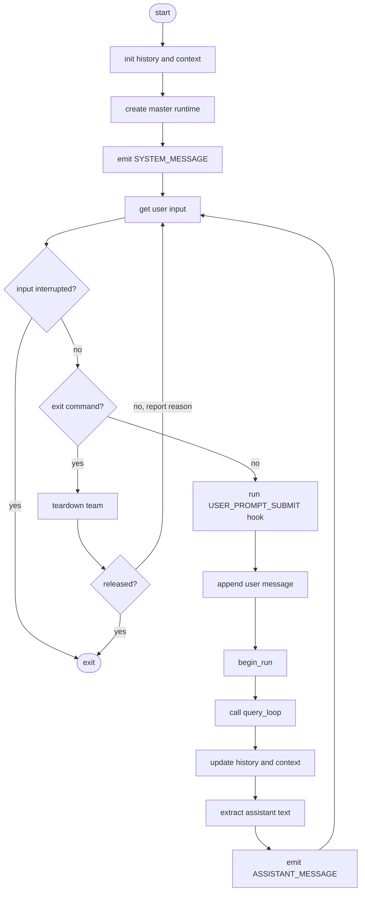

# Agent 顶层入口

`core/agent.py` 是 CLI Agent 的顶层编排入口。它负责创建主 Agent Runtime 及同会话的 TeamRuntime、接收用户输入、调用 query loop 和输出 Assistant 文本，不实现模型调用、工具执行或压缩策略。团队内部职责见 [Agent Team 架构](agent_team.md)。

## 1. Agent 层的职责

```text
用户输入 → Agent 顶层入口 → AgentRuntime → query_loop()
                                      ↓
                              Assistant 文本输出
```

Agent 层主要负责：

- 初始化会话历史和上下文。
- 根据启动配置创建主 Agent Runtime。
- 处理 CLI 输入和退出信号。
- 在用户输入提交前运行 `UserPromptSubmit` Hook。
- 调用 `query_loop()`。
- 根据返回的状态更新历史、上下文和最终输出。

模型适配、工具执行、权限检查、事件发布和审批分别由 Runtime 中的组件负责。

## 2. `create_master_runtime()`

`create_master_runtime(history, context, events, interaction, session_id=None, additional_tools=None, additional_tool_handlers=None)` 创建主 Agent 使用的 `AgentRuntime`。可选的工具定义与 handler 只注入该实例，供当前 Master session 绑定团队工具。

### 2.1 读取配置

函数从 `config.Config()` 读取：

- 当前模型配置。
- fallback 模型名称。
- 上下文窗口和主输出 token 预算。
- 当前工作目录。

fallback 配置复制自当前模型配置，只替换 `model_name`：

```python
fallback_model = dict(configured_model)
fallback_model["model_name"] = (
    configured_model.get("fallback_model_name")
    or configured_model["model_name"]
)
```

### 2.2 创建 `RunPolicy`

主 Agent 当前使用的策略包括：

| 参数 | 当前值或来源 |
| ---- | ---- |
| `max_turns` | `300` |
| `prompt` | `你是一个编码助手` |
| `model` | 当前配置中的模型 |
| `fallback_model` | 当前配置生成的 fallback 模型 |
| `tools_list` | `tools.TOOLS_LIST` 加当前实例的 `additional_tools` |
| `tool_handler` | `tools.TOOLS_HANDLERS` 加当前实例的 `additional_tool_handlers` |
| `can_ask_user` | `True` |

### 2.3 创建 `state`

`state` 使用调用方传入的 `history` 和 `context`，并根据配置初始化：

- `max_output_tokens`：主输出预算。
- `turn_count`：`0`。
- `current_model`：主模型配置。
- `recovery_count`：`0`。
- `max_output_tokens_override`：`False`。
- `has_attempted_reactive_compact`：`False`。
- `consecutive_529`：`0`。

### 2.4 组装 Runtime

主 Agent 使用读写模式的记忆策略：

```python
MemoryPolicy(
    mode=MemoryMode.READ_WRITE,
    namespace="master",
)
```

之后调用 `RuntimeFactory.create()`，并显式注入：

- `CliEventSink()`：把事件渲染到 CLI。
- `CliInteraction()`：读取用户输入并处理审批。

Hook、Memory、Prompt、Artifact 和 ToolExecutor 由 RuntimeFactory 按默认规则组装。

## 3. `master_agent()`

### 3.1 初始化

函数开始时创建空的：

```python
history = []
context = builtin.update_context({})
```

随后为会话生成 `session_id`，在 `.agents/runs/<session_id>/tasks` 组装 sibling TeamRuntime，将 Master 专属团队工具绑定给它，再调用 `create_master_runtime(...)` 注入相同的 `session_id` 和这些工具。TeamRuntime 独立于 AgentRuntime；创建团队本身不会启动 TeamAgent 模型。

### 3.2 发送系统提示

Runtime 创建后，Agent 发送一个 `SYSTEM_MESSAGE` 事件，提示用户：

- 输入问题并回车发送。
- 输入退出命令结束 CLI Agent。

### 3.3 用户输入循环

每次循环执行以下步骤：

1. 调用 `runtime.interaction.get_user_input()`。
2. 输入阶段收到 `EOFError` 或 `KeyboardInterrupt` 时直接退出循环。
3. 检查退出命令。
4. 运行 `USER_PROMPT_SUBMIT` Hook。
5. 将用户消息追加到 `history`。
6. 调用 `runtime.begin_run()` 重置本轮计数及恢复状态。
7. 调用 `query_loop(runtime)`。
8. 使用返回的 `state.messages` 更新历史。
9. 使用 `builtin.update_context()` 更新上下文。
10. 提取最后一条 Assistant 消息中的文本块，并发送 `ASSISTANT_MESSAGE`。

当前代码通过以下判断处理正常退出请求：

```python
normalized_input = user_input.strip().lower()
if not normalized_input or normalized_input in ("q", "exit"):
    close_result = team_runtime.coordinator.teardown_team()
    if close_result["released"]:
        break
    # 报告失败并保持会话，恢复任务后再尝试退出
```

空输入、`q` 和 `exit` 都进入安全收尾。成员仍有未完成任务或 teardown 失败时，CLI 报告原因并继续接受输入；原 owner 续跑或 FAILED 任务交接完成后，可再次退出。

## 4. `master_agent()` 流程图

以下流程图只使用 ASCII 标签，避免 Markdown 预览器的 Mermaid 编码问题：


```mermaid
flowchart TD
    A([start]) --> B[init history and context]
    B --> C[create master runtime]
    C --> D[emit SYSTEM_MESSAGE]
    D --> E[get user input]
    E --> F{input interrupted?}
    F -->|yes| Z([exit])
    F -->|no| G{exit command?}
    G -->|yes| T[teardown team]
    T --> U{released?}
    U -->|yes| Z
    U -->|no, report reason| E
    G -->|no| H[run USER_PROMPT_SUBMIT hook]
    H --> I[append user message]
    I --> J[begin_run]
    J --> K[call query_loop]
    K --> L[update history and context]
    L --> M[extract assistant text]
    M --> N[emit ASSISTANT_MESSAGE]
    N --> E
```

## 5. Agent 和 Loop 的边界

| 模块 | 负责内容 |
| ---- | ---- |
| `agent.py` | 顶层输入、Runtime 创建、循环调用、上下文更新、输出事件。 |
| `loop.py` | 模型请求、错误恢复、压缩、Stop Hook、工具调用编排。 |
| `runtime.py` | 保存策略、状态和运行组件。 |
| `event/` | 定义事件和事件消费端。 |
| `hook/` | 定义 Hook 扩展点和权限检查。 |
| `event/interaction.py` | 定义用户输入和审批接口。 |
| `team/` 与 `tools/team.py` | TeamRuntime 组装、团队状态与 Master 实例专属工具绑定。 |

Agent 层不应直接调用 `ToolExecutor` 或模型 Adapter。需要执行工作时，应通过 `query_loop(runtime)` 完成。
