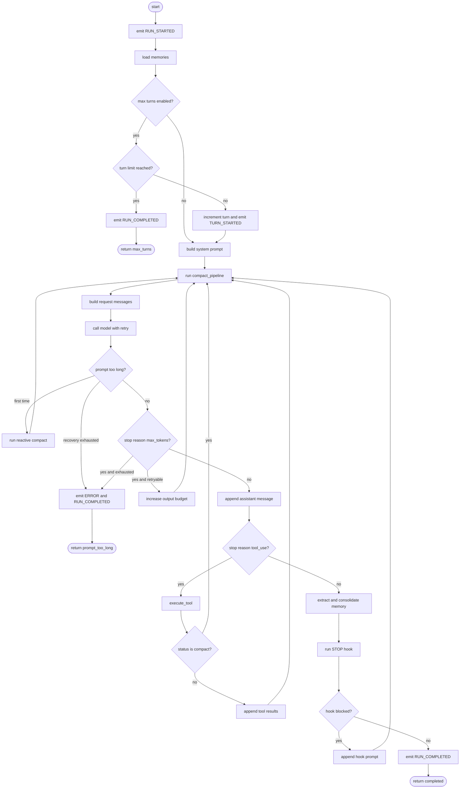
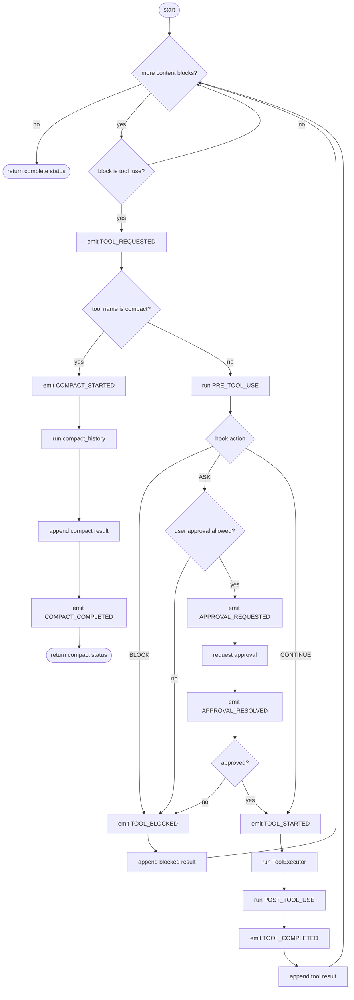
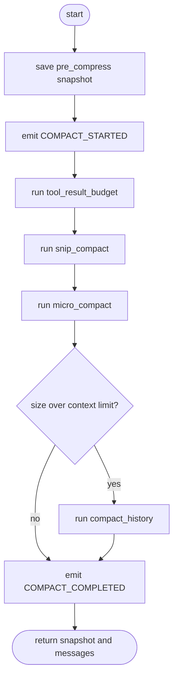
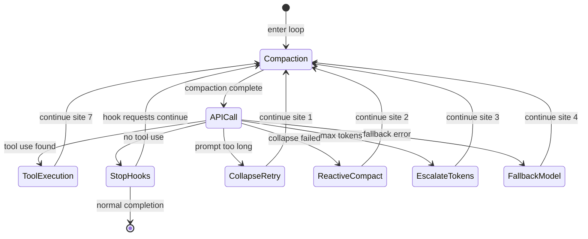

# Loop 工作循环

`core/loop.py` 负责调用模型接口、执行工具调用、压缩会话历史和保存模型输出。它通过 `AgentRuntime` 取得配置和运行组件，为不同类型的 Agent 提供统一的 query loop。

## 1. `query_loop()` 的作用

`query_loop()` 在一次 Agent Runtime 中重复执行以下工作：

```text
准备上下文 → 压缩历史 → 调用模型 → 处理响应 → 工具或 Stop Hook → 下一轮
```

它不负责获取 CLI 输入，也不直接实现具体工具逻辑。顶层输入和输出由 [agent.md](./agent.md) 中的 `master_agent()` 负责。

## 2. `query_loop()` 的输入与返回值

### 2.1 `RunPolicy`

`RunPolicy` 是所有 Agent 共用的 query loop 配置。它在循环中作为策略输入，运行过程中的变化记录在 `state` 中。

参数包括：

- `max_turns`：最大循环次数。
- `prompt`：系统提示词或静态提示词配置。
- `model`：默认模型配置。
- `fallback_model`：失败时使用的模型配置。
- `tools_list`：可以使用的工具定义列表。
- `tool_handler`：工具名称到执行函数的映射。
- `can_ask_user`：是否可以进入用户审批流程。

### 2.2 `state`

`state` 用于记录 query loop 循环中的可变状态：

| 字段 | 意义 |
| ---- | ---- |
| `messages` | 对话消息列表。 |
| `context` | 记忆、系统状态等上下文参数。 |
| `max_output_tokens` | 当前模型请求的最大输出 token 数。 |
| `toolUse_prompt` | 动态工具调用提示词。 |
| `turn_count` | 当前循环次数。 |
| `transition` | 上次循环迭代的原因。 |
| `max_output_tokens_override` | 是否覆盖默认输出 token 数。 |
| `recovery_count` | 输出过长恢复次数。 |
| `has_attempted_reactive_compact` | 是否尝试过反应式压缩。 |
| `current_model` | 当前实际使用的模型配置。 |
| `consecutive_529` | 连续出现 529 错误的次数。 |

### 2.3 Return

`query_loop()` 返回更新后的状态和结束状态：

```python
result_state, status = query_loop(runtime)
```

当前实现的返回状态：

| 状态 | 含义 |
| ---- | ---- |
| `{"reason": "completed"}` | 没有工具调用，且 Stop Hook 没有阻止结束。 |
| `{"reason": "max_turns"}` | 达到 `RunPolicy.max_turns`。 |
| `{"reason": "prompt_too_long"}` | 上下文压缩或输出恢复后仍无法继续。 |

未被 query loop 恢复的其他异常会继续向调用方抛出，不会统一转换为状态对象。

## 3. 当前 `query_loop()` 流程

进入循环前：

0. 发送 `RUN_STARTED`。
1. 从 `runtime.state` 读取策略和状态。
2. 调用 `runtime.memory.load()` 加载记忆。

每一轮循环中：

3. 检查 `max_turns`，必要时发送 `RUN_COMPLETED` 并返回。
4. 增加 `turn_count`，发送 `TURN_STARTED`。
5. 使用 `runtime.prompt.build()` 构建系统提示词。
6. 执行 `compact_pipeline()`。
7. 使用 `struct_massages()` 构建请求消息。
8. 通过 Adapter 调用模型，并由 `with_llm_retry()` 处理重试和 fallback。
9. 处理上下文过大或输出截断恢复。
10. 保存 Assistant 响应。
11. 有工具调用时执行 `execute_tool()`。
12. 没有工具调用时提取记忆并运行 Stop Hook。
13. 普通工具结果或 Stop Hook 产生的继续消息会让循环回到下一轮。

## 4. Normal ToolCall 生命周期

普通工具调用必须经过完整的工具生命周期：

```text
TOOL_REQUESTED
    ↓
PreToolUse
    ↓
approval / block
    ↓
TOOL_STARTED
    ↓
ToolExecutor
    ↓
PostToolUse
    ↓
TOOL_COMPLETED
```

具体规则：

- `TOOL_REQUESTED` 表示模型提出了工具调用。
- `PreToolUse` 返回 `CONTINUE` 时，直接进入工具执行。
- `PreToolUse` 返回 `ASK` 时，只有审批通过才能进入工具执行。
- `BLOCK`、审批拒绝或 `can_ask_user=False` 时，发送 `TOOL_BLOCKED` 并生成工具结果。
- 被阻止的工具不会进入 `ToolExecutor`，也不会触发 `PostToolUse`。
- `PostToolUse` 在 `ToolExecutor.execute()` 返回后执行。
- `TOOL_COMPLETED` 在 PostToolUse 返回后发送。
- 普通工具结果会追加到消息列表，并由 `query_loop()` 进入下一轮。

## 5. Compact Control Action 生命周期

`compact` 是内部控制操作，不是普通工具执行。其核心生命周期是：

```text
COMPACT_STARTED
    ↓
compact pipeline
    ↓
COMPACT_COMPLETED
```

当模型生成名为 `compact` 的 tool call 时，`execute_tool()` 会先发送 `TOOL_REQUESTED`，然后识别出这是控制操作：

- 不触发 `PreToolUse`。
- 不请求用户审批。
- 不调用 `ToolExecutor`。
- 不触发 `PostToolUse`。
- 调用 `tools.compact_history()`。
- 返回 `results, "compact"`。
- `query_loop()` 收到 `status == "compact"` 后直接进入下一轮。

自动压缩、反应式压缩和 `compact` 工具都使用 `COMPACT_STARTED` 与 `COMPACT_COMPLETED`，但触发函数不同：

| 触发来源 | 调用位置 | 压缩动作 |
| ---- | ---- | ---- |
| 自动压缩 | `compact_pipeline()` | 工具结果预算、裁剪、占位替换，必要时历史压缩。 |
| 反应式压缩 | `query_loop()` 的 prompt-too-long 分支 | `tools.reactive_compact()`。 |
| `compact` 工具 | `execute_tool()` 的特殊分支 | `tools.compact_history()`。 |

## 6. `compact_pipeline()`

`compact_pipeline(runtime)` 负责每轮模型请求前的历史压缩：

1. 保存压缩前的消息快照 `pre_compress`。
2. 发送 `COMPACT_STARTED`。
3. 执行 `tools.tool_result_budget()`。
4. 执行 `tools.snip_compact()`。
5. 执行 `tools.micro_compact()`。
6. 如果估算大小超过上下文限制，执行 `tools.compact_history()`。
7. 发送 `COMPACT_COMPLETED`。
8. 返回压缩前快照和压缩后的消息。

压缩前快照用于在本轮结束时提取记忆，压缩后的消息用于构建模型请求。

## 7. `execute_tool()`

`execute_tool(response, runtime)` 遍历 `ModelResponse.content` 中的工具块，返回：

```python
results, status = execute_tool(response, runtime)
```

普通工具调用返回 `status == "complete"`；`compact` 控制操作返回 `status == "compact"`。

普通工具的处理顺序是：

1. 发送 `TOOL_REQUESTED`。
2. 运行 `PreToolUse` Hook。
3. 根据 Hook 结果处理阻止或审批。
4. 发送 `TOOL_STARTED`。
5. 调用 `runtime.tools.execute()`。
6. 运行 `PostToolUse` Hook。
7. 发送 `TOOL_COMPLETED`。
8. 保存工具结果。

## 8. `_handle_pre_tool_hook_result()`

该函数将 `HookResult` 转换成工具执行前的结果：

| HookAction | 当前行为 |
| ---- | ---- |
| `CONTINUE` | 返回 `None`，允许执行工具。 |
| `BLOCK` | 发送 `TOOL_BLOCKED`，返回阻塞工具结果。 |
| `ASK` 且禁止询问 | 发送 `TOOL_BLOCKED`，返回阻塞工具结果。 |
| `ASK` 且允许询问 | 发送审批请求，等待 Interaction 返回结果。 |

审批结果会分别发送 `APPROVAL_REQUESTED` 和 `APPROVAL_RESOLVED`。审批通过返回 `None`；审批拒绝返回阻塞工具结果。

## 9. `query_loop()` 流程图

以下 Mermaid 图只使用 ASCII 标签：



## 10. `execute_tool()` 流程图



## 11. `compact_pipeline()` 流程图



## 12. 目标形态：七个 Continue 站点

以下内容保留自早期 query loop 设计。它描述的是目标形态或预留设计，不是当前已经稳定实现的完整状态协议。

| Site | 目标触发 | 目标动作 |
| ---- | ---- | ---- |
| 1. Proactive Compaction | token 超过阈值 | 自动压缩，生成新消息后继续。 |
| 2. Prompt Too Long | API 返回 prompt-too-long | context collapse 或反应式压缩后继续。 |
| 3. Max Output Tokens | 模型输出截断 | 升级输出预算并进行多轮重试。 |
| 4. Fallback Model | FallbackTriggeredError | 切换模型后重试请求。 |
| 5. Stop Hook Blocking | Stop Hook 要求额外轮次 | 注入 Hook 消息后继续。 |
| 6. Image/Media Errors | 图片或媒体过大 | 移除或压缩媒体后继续。 |
| 7. Tool Execution | 普通工具完成 | 收集结果、更新状态后继续。 |

目标形态中的终止条件是：没有工具调用，且 Stop Hook 不阻止继续时返回；恢复失败、重试耗尽和用户中断等状态需要后续实现统一协议。



早期草图中的以下状态仍属于目标形态，当前 `query_loop()` 不会全部返回：

```python
return {"reason": "blocking_limit"}       # target: hard token limit
return {"reason": "stop_hook_prevented"}  # target: stop hook prevents continue
return {"reason": "aborted_streaming"}    # target: user interrupts model output
return {"reason": "aborted_tools"}        # target: user interrupts tool execution
return {"reason": "hook_stopped"}         # target: hook stops the run
return {"reason": "image_error"}           # target: image or PDF is too large
return {"reason": "model_error", "error": error}  # target: normalized model error
```

## 13. Runtime 摘要

早期文档中 Runtime 的核心组件描述仍然适用，但当前实现还包括 `policy`、`state`、`agent_name`、`agent_id`、`artifacts` 和 `interaction`：

- `paths`：当前 Agent 的运行路径。
- `hooks`：当前 Agent 的 Hook 管理器。
- `events`：当前 Agent 的事件接收器。
- `memory`：当前 Agent 的记忆管理器。
- `prompt`：当前 Agent 的提示词构建器。
- `tools`：当前 Agent 的工具执行器。

完整 Runtime 说明见 [runtime.md](./runtime.md)。
