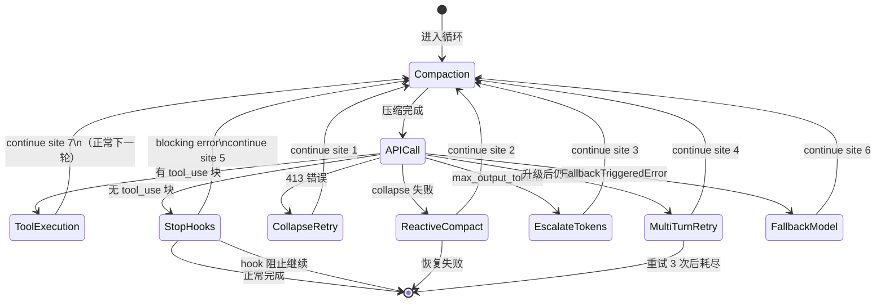

# 1. queryLoop 的作用
queryLoop 循环负责调用模型接口，执行工具调用，保存模型输出。该循环在 Agent 运行时重复执行，直到满足某个条件。


# 2. queryLoop 的传入参数与返回值

- RunPolicy：所有的 Agent 共用的通用 queryLoop 循环结构，通过配置 queryLoop 的 RunPolicy 中参数的不同得到不同种类的 Agent。  

- state：一个 Agent 的运行状态通过 state 中的参数进行记录，这些参数随着 queryLoop 循环的进行而改变。

- 返回值：包括 state 中的参数（以及 status 参数）

## 2.1 RunPolicy
用于配置 queryLoop 循环的参数，该参数在循环中不改变。

参数包括：
- max_turns: 最大循环次数
- prompt: 系统提示词、用户提示词（静态提示词）
- model: 调用的模型
- fallback_model: 失败时调用的模型
- tools_list: 可以使用的工具的列表
- can_ask_user: 是否可以询问用户问题


## 2.2 state 
用于记录 queryLoop 循环的运行状态，该参数在循环中会改变。（关于压缩、总结等的参数还未编设）

参数包括：
- messages: 对话消息列表
- context: 上下文参数，用于存储会话中的记忆、系统状态等信息
- max_output_tokens: 最大输出token数
- toolUse_prompt: 工具调用提示词（动态提示词）
- turn_count: 当前循环次数计数
- transition: 上次循环迭代的原因
- max_output_tokens_override: 是否覆盖最大输出token数
- recovery_count: 最大输出token数恢复次数
- has_attempted_reactive_compact: 是否尝试过恢复压缩


## 2.3 Return
返回值包括：
- state: 更新后的状态参数
- status: 循环结束的状态（成功或失败的原因）

``` python
 10 种终止原因
return { reason: 'completed' }           # 正常完成（无工具调用 + Stop Hook 不阻止）
return { reason: 'blocking_limit' }      # 硬性 token 限制
return { reason: 'stop_hook_prevented' } # Stop Hook 阻止继续
return { reason: 'aborted_streaming' }   # 用户中断（模型响应中）
return { reason: 'aborted_tools' }       # 用户中断（工具执行中）
return { reason: 'hook_stopped' }        # Hook 附件停止继续
return { reason: 'max_turns', turnCount }# 达到最大轮次限制
return { reason: 'prompt_too_long' }     # 413 恢复耗尽
return { reason: 'image_error' }         # 图片/PDF 太大
return { reason: 'model_error', error }  # 意外异常
```

# 3. queryLoop 的流程

流程：  
进入循环前：
0. 解析权限、状态参数
1. 记忆提取、提示词加载

进入循环后：
2. 执行压缩管线
3. 规范化请求消息构建
4. 调用 LLM
5. 错误恢复（7 个 continue 站点）
6. 收集 tool_use 块
7. 执行工具调用
8. Stop Hook → 终止或继续
9. 更新状态 → continue


# 4. 循环的七个 Continue 站点




┌─────────────────────────────────────────────────┐
│                 queryLoop()                      │
│                                                  │
│  ┌──────────────────────────────────────────┐   │
│  │ Continue Site 1: Proactive Compaction     │   │
│  │ 触发: token 超过阈值                      │   │
│  │ 动作: autocompact → 新消息 → continue     │   │
│  └──────────────────────────────────────────┘   │
│                                                  │
│  ┌──────────────────────────────────────────┐   │
│  │ Continue Site 2: Prompt Too Long          │   │
│  │ 触发: API 返回 prompt-too-long 错误       │   │
│  │ 动作: context-collapse → reactive compact │   │
│  └──────────────────────────────────────────┘   │
│                                                  │
│  ┌──────────────────────────────────────────┐   │
│  │ Continue Site 3: Max Output Tokens        │   │
│  │ 触发: 模型输出截断                        │   │
│  │ 动作: 升级 8k→64k → 多轮重试（最多3次）   │   │
│  └──────────────────────────────────────────┘   │
│                                                  │
│  ┌──────────────────────────────────────────┐   │
│  │ Continue Site 4: Fallback Model           │   │
│  │ 触发: FallbackTriggeredError             │   │
│  │ 动作: 切换模型 → 重试请求                 │   │
│  └──────────────────────────────────────────┘   │
│                                                  │
│  ┌──────────────────────────────────────────┐   │
│  │ Continue Site 5: Stop Hook Blocking       │   │
│  │ 触发: 用户 Hook 要求额外轮次              │   │
│  │ 动作: 注入 Hook 消息 → continue           │   │
│  └──────────────────────────────────────────┘   │
│                                                  │
│  ┌──────────────────────────────────────────┐   │
│  │ Continue Site 6: Image/Media Errors       │   │
│  │ 触发: ImageSizeError / ImageResizeError   │   │
│  │ 动作: 反应式压缩（移除图片）→ continue    │   │
│  └──────────────────────────────────────────┘   │
│                                                  │
│  ┌──────────────────────────────────────────┐   │
│  │ Continue Site 7: Tool Execution           │   │
│  │ 触发: 正常工具执行完成                    │   │
│  │ 动作: 收集结果 → 更新状态 → continue      │   │
│  └──────────────────────────────────────────┘   │
│                                                  │
│  ┌──────────────────────────────────────────┐   │
│  │ return Terminal — 唯一的退出点             │   │
│  │ 条件: 无工具调用 + Stop Hook 不阻止        │   │
│  └──────────────────────────────────────────┘   │
└─────────────────────────────────────────────────┘


# 5. Runtime
用于记录 agent 实际运行环境的类：
- agent: AgentDefinition 
  - name: str
  - agent_id: str
- paths: RuntimePaths 当前 agent 的运行路径
- hooks: HookManager 当前 agent 的 Hook 管理器
- events: EventSink 当前 agent 的事件接收器
- memory: MemoryManager 当前 agent 的内存管理器
- prompt: PromptBuilder 当前 agent 的提示词构建器
- tools: ToolExecutor 当前 agent 的工具执行器