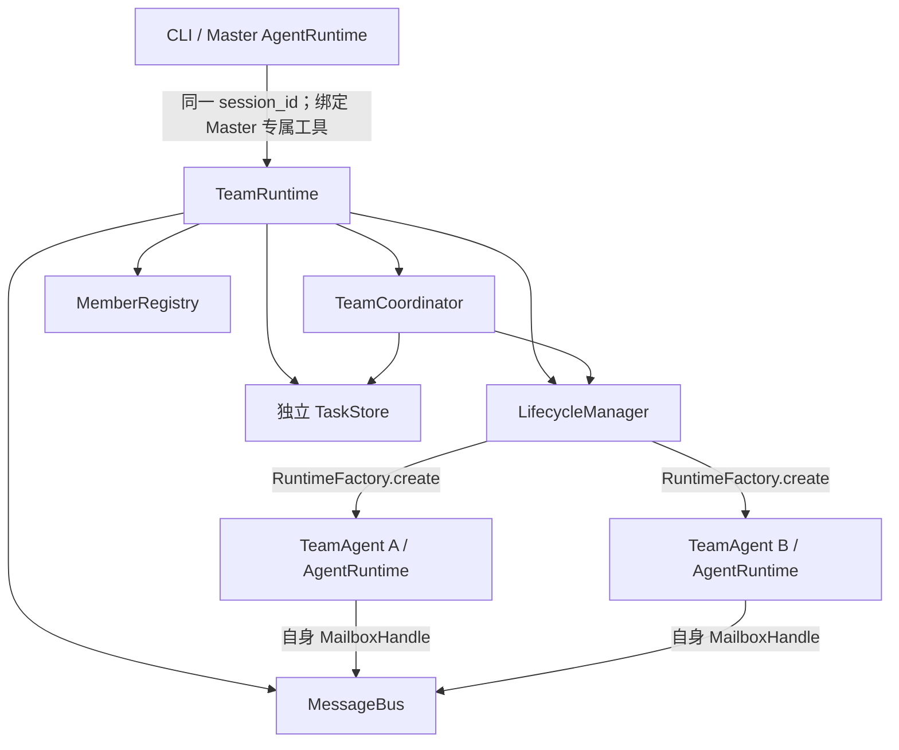

# Agent Team 架构

Agent Team 让 Master 在同一会话中创建多个独立的 TeamAgent，并显式分配任务。TeamAgent 复用现有 `AgentRuntime` 与 `query_loop()`；团队共享状态由独立的 `TeamRuntime` 组装，不放进 Master 的 `AgentRuntime`。

## 1. 组成与所有权

| 组件 | 拥有的状态与职责 |
| --- | --- |
| `TeamRuntime` | 每个 Master session 一份，组装 Registry、Bus、TaskStore、LifecycleManager 和 Coordinator；与 Master 共用 `session_id`。 |
| `TeamCoordinator` | 编排创建、任务分配/续跑、FAILED 任务交接和团队收尾；通过现有 `task_system` 操作独立 TaskStore。 |
| `LifecycleManager` | 唯一创建并持有 TeamAgent runtime/wrapper 的入口，负责正常停止、fatal 报告和最终释放。 |
| `MemberRegistry` | 成员状态的唯一权威来源；状态变化经受控 transition。 |
| `MessageBus` | 管理团队内存 mailbox；成员只能通过自己的 `MailboxHandle` 收发。 |
| `TeamAgent` | 被动执行 wrapper，持有独立的 runtime、消息历史与身份，运行时调用既有 `query_loop()`。 |

团队 TaskStore 保存于 `workspace/.agents/runs/<session_id>/tasks`。旧任务工具未显式注入 store 时仍使用全局 `TASKS`；团队路径不会另建任务模型。成员的 STOPPED / FAILED 记录保留到 TeamRuntime 最终释放；任务文件在释放后仍保留。

## 2. 工具和运行路径

`core/agent.py` 创建 Master runtime 与 sibling TeamRuntime，并把 `tools/team.py` 的工具及 handler 只绑定给当前 Master 实例。Master 可以创建成员、查看和分配任务、显式续跑、查询成员、停止和释放团队；普通 Subagent 与 TeamAgent 没有这些 Master 工具。

创建成员经过 `Master tool → TeamCoordinator → LifecycleManager → RuntimeFactory → MemberRegistry`，发布为 IDLE 后返回。**Spawn 不会启动模型。** 分配任务时，Coordinator 在 TaskStore 中记录 owner、将成员转为 BUSY，然后同步调用 TeamAgent 的统一 query loop。TeamAgent 的任务工具通过实际 runtime 身份校验，只能完成当前执行轮分配给自己的任务；完成后任务为 `completed`，成员回到 IDLE。

TeamAgent 的 `send_team_message` / `receive_team_message` 经自身 `MailboxHandle` 访问 MessageBus。接收为非阻塞操作，空队列返回 `null`；收发不会自动启动另一名 TeamAgent，也不会自行改变成员状态。TeamAgent 不会空闲时自主从看板领取任务。

## 3. 未完成任务与收尾

- 一轮未完成或普通执行异常：任务保留 `in_progress` 与原 owner，成员保持 BUSY；Master 使用 `resume_team_task` 让原 owner 显式续跑。其他成员不能接管。
- 明确的不可恢复故障：`report_team_fatal` 将成员标为 FAILED；其未完成任务仍保留原 owner。Master 使用 `recover_failed_team_task` 创建**新** TeamAgent，TaskStore 原子保存 owner 交接记录，再同步执行一轮；旧 FAILED 记录在最终释放前可查询。
- 正常停止只接受安全状态。成员持有未完成任务时，`shutdown_teammate` 与 `teardown_team` 返回明确失败并保留可恢复的会话；`q` / `exit` 只有在团队成功释放后才结束 CLI。最终释放清空成员和 mailbox，保留任务文件。

上述为当前实现概览；完整状态机、失败策略与约束以 [Agent Team 规格](<../features/agent team/02_architecture.md>)、[运行流程](<../features/agent team/03_runtime.md>)和[契约](<../features/agent team/04_contracts.md>)为准。

## 4. 验证层次

默认 pytest 使用单元、契约、架构和 fake loop 集成测试，不连接模型。手动的 [单成员 smoke](../../scripts/team_real_model_smoke.py) 验证真实模型完成任务；[扩展验收](../../scripts/team_real_model_acceptance.py) 验证双成员消息、原 owner 续跑与 FAILED 交接。交互式 Master 另行检查模型自行选择团队工具。命令、通过条件与失败分类见[运行测试笔记](../note/s13_agent_team_testing_note.md)；正式检查编号见[测试计划](<../features/agent team/07_test_plan.md>)。
